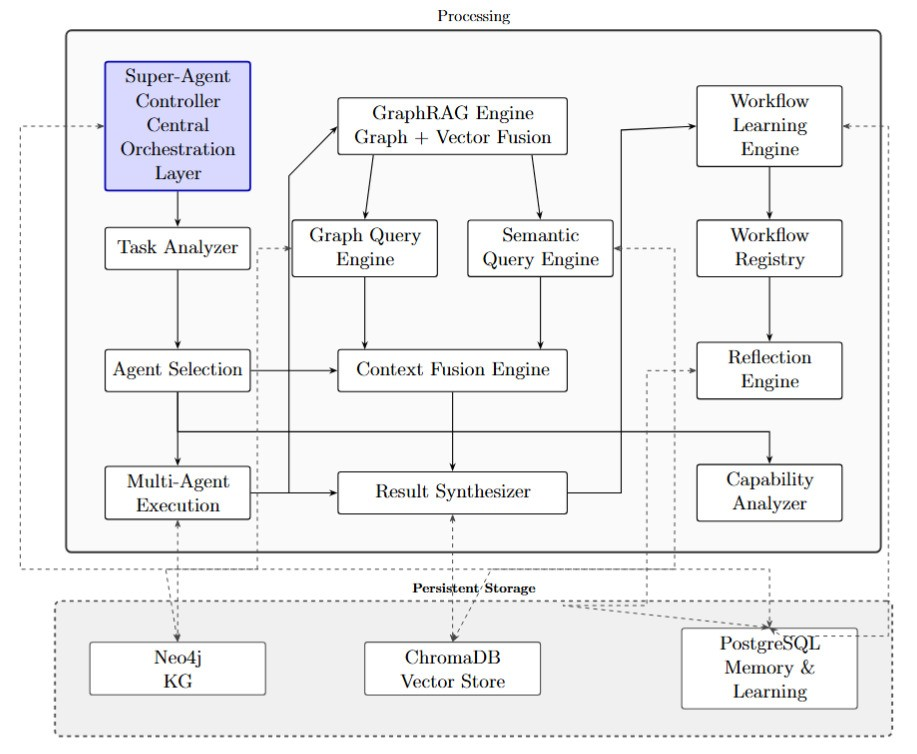

# GRAGSA-KG: A Hierarchical Multi-Agent Decision Intelligence Framework with Knowledge Graph Memory and GraphRAG

An AI-driven Decision Intelligence Platform that combines multi-agent workflows, knowledge graphs, vector retrieval, and dynamic agent creation to deliver comprehensive analysis and insights for complex business and technical tasks.

## Overview

Super-Agent Knowledge Graph is an advanced multi-agent system that orchestrates specialized AI agents to analyze complex queries, generate structured insights, and learn from past executions. At its core is the **Super-Agent Controller** - the central orchestration engine that coordinates all subsystems and manages the complete workflow lifecycle. The system leverages:

- **Super-Agent Orchestration**: Central controller coordinating task analysis, agent selection, and workflow execution
- **Multi-Agent System**: Sequential execution of specialized agents with dynamic selection and collaboration
- **Knowledge Graph**: Neo4j-based persistent knowledge store for tasks, findings, risks, and recommendations
- **Vector Retrieval**: ChromaDB-powered semantic search for context retrieval
- **GraphRAG**: Unified fusion of graph and vector retrieval for enhanced context
- **Dynamic Agents**: Runtime creation of specialized agents based on capability gaps
- **Skills System**: Modular, reusable skills that can be assigned to agents
- **Workflow Learning**: Pattern recognition and workflow optimization from historical data
- **Chain of Thought**: Transparent reasoning process tracking and execution traceability

## Architecture

### System Components




### Core Modules

#### 1. **Multi-Agent System** (`agents/`)
- **BaseAgent**: Abstract contract for all agents
- **Static Agents**: Research, Risk, Strategy agents with predefined capabilities
- **Dynamic Agents**: Runtime-generated agents with specialized skills
- **Agent Factory**: Creates agent instances based on selection
- **Agent Selector**: Chooses optimal agents for tasks using relevance matching

#### 2. **Knowledge Graph** (`graph/`)
- **GraphManager**: Neo4j connection management with retry logic
- **KnowledgeGraphBuilder**: Constructs graph from workflow results
- **QueryEngine**: Semantic graph traversal and context retrieval
- **Repository**: CRUD operations for graph nodes and relationships
- **Schema**: Defines node types (Task, Agent, Finding, Risk, Recommendation, Skill)

#### 3. **Vector Retrieval** (`rag/`)
- **SemanticQueryEngine**: ChromaDB-based semantic search
- **KnowledgeIndexer**: Indexes workflow results for vector retrieval
- **GraphRAGEngine**: Fuses graph and vector retrieval
- **ContextFusionEngine**: Merges and deduplicates retrieval results
- **ContextSummarizer**: Generates unified context summaries

#### 4. **Dynamic Agents** (`dynamic_agents/`)
- **AgentGenerator**: Creates new agents from task analysis
- **CapabilityAnalyzer**: Identifies skill gaps and requirements
- **AgentRegistry**: Manages dynamic agent lifecycle
- **Deduplication**: Prevents duplicate agent creation
- **GraphIntegration**: Links agents to skills in knowledge graph

#### 5. **Skills System** (`skills/`)
- **SkillManager**: Loads and manages skill definitions
- **SkillGraphIntegration**: Connects skills to agents in graph
- **Skills**: Modular analysis capabilities (SWOT, PESTEL, Risk Assessment, etc.)
- **Metrics**: Tracks skill usage and performance

#### 6. **Learning System** (`learning/`)
- **WorkflowLearningEngine**: Analyzes completed workflows for patterns
- **WorkflowRegistry**: Stores and retrieves workflow patterns
- **ReflectionEngine**: Generates insights from workflow execution
- **Scoring**: Evaluates pattern success rates

#### 7. **Memory System** (`memory/`)
- **MemoryService**: Records workflow executions and agent performance
- **QueryEngine**: Retrieves historical context for decision support
- **Repository**: PostgreSQL-based persistence layer
- **Models**: WorkflowMemory, AgentExecution, RetrievalRecord

#### 8. **Super-Agent Orchestration System** (`superagent/`)
- **Super-Agent Controller**: Central coordinator managing the complete workflow lifecycle
  - Task analysis and requirement extraction
  - Dynamic agent selection using relevance matching
  - Sequential agent orchestration and execution
  - Integration of GraphRAG context retrieval
  - Memory storage and learning pipeline coordination
  - Chain of thought tracking and narrative generation
- **AgentFactory**: Instantiates static and dynamic agents
- **AgentSelector**: Chooses optimal agents based on task requirements
- **AgentRegistry**: Manages agent metadata and availability
- **TaskAnalyzer**: Analyzes queries to extract task type and required skills
- **ContextManager**: Manages task context, findings, risks, and recommendations
- **ChainOfThought**: Tracks reasoning process and generates execution narratives
- **TaskContext**: Data model for task state and execution metadata
- **Schemas**: Pydantic models for TaskAnalysis and WorkflowResult

## Features

### Multi-Agent Workflow Execution
- **Sequential Agent Orchestration**: Agents execute in sequence, building on each other's outputs
- **Dynamic Agent Selection**: Relevance matcher selects diverse agents with complementary skills
- **Capability Gap Analysis**: Identifies missing skills and creates specialized agents dynamically
- **Context Propagation**: Findings, risks, and recommendations flow between agents

### Knowledge Graph
- **Structured Knowledge Storage**: Tasks, findings, risks, recommendations stored as interconnected nodes
- **Semantic Relationships**: Graph structure preserves context and relationships
- **Efficient Retrieval**: Sub-30ms average context retrieval latency
- **Knowledge Density**: 1.83 relationships per node for rich interconnections

### Vector Retrieval
- **Semantic Search**: OpenAI embeddings for similarity-based retrieval
- **Multi-Type Indexing**: Separate indexing for findings, risks, and recommendations
- **Context Filtering**: Retrieve by source type and metadata
- **Scalable Storage**: ChromaDB for efficient vector operations

### GraphRAG Fusion
- **Unified Retrieval**: Combines graph structure and vector semantics
- **Context Fusion**: Merges and deduplicates results from both sources
- **Enhanced Similarity**: +6.28% improvement in semantic relevance
- **Increased Richness**: +31.85% more context items per query

### Dynamic Agent Creation
- **Runtime Generation**: Creates specialized agents based on task requirements
- **Skill-Based Composition**: Agents constructed from available skills
- **Deduplication**: Prevents redundant agent creation
- **Usage Tracking**: Monitors agent effectiveness and reuse

### Skills System
- **Modular Skills**: 15+ specialized analysis skills (SWOT, PESTEL, Risk Assessment, etc.)
- **Agent Assignment**: Skills dynamically assigned to agents
- **Performance Metrics**: Tracks skill usage frequency and effectiveness
- **Graph Integration**: Skills linked to agents in knowledge graph

### Workflow Learning
- **Pattern Recognition**: Identifies successful workflow patterns
- **Recommendations**: Suggests optimal agent sequences for task types
- **Success Scoring**: Evaluates pattern effectiveness over time
- **Continuous Improvement**: System learns from each workflow execution

### Memory & Analytics
- **Workflow History**: Complete record of all executions
- **Agent Performance**: Tracks execution time and success rates
- **Retrieval Statistics**: Monitors graph and vector retrieval effectiveness
- **Usage Analytics**: Identifies most-used agents and skills

### Super-Agent Orchestration
- **Centralized Workflow Control**: Single controller coordinating all subsystems (graph, vector, learning, memory, dynamic agents)
- **Intelligent Task Analysis**: Extracts task type, required skills, and complexity from natural language queries
- **Dynamic Agent Selection**: Uses relevance matching to select diverse agents with complementary skills
- **Sequential Execution**: Orchestrates agents in optimal sequence with context propagation
- **Capability Gap Detection**: Identifies missing skills and triggers dynamic agent creation
- **Context Integration**: Seamlessly integrates GraphRAG retrieval into workflow execution
- **Memory Coordination**: Records workflow executions, agent performance, and retrieval statistics
- **Learning Pipeline**: Processes completed workflows for pattern extraction and optimization
- **Chain of Thought Tracking**: Generates transparent reasoning narratives for each workflow
- **Execution Monitoring**: Tracks timing, performance, and success metrics for each agent
- **Error Handling**: Graceful degradation with fallback mechanisms when subsystems fail
- **Result Formatting**: Structures outputs into findings, risks, and recommendations with confidence scores

## Performance Metrics

### System Performance
- **Task Success Rate**: 100%
- **Agent Coverage**: 100% (vs 29% baseline)
- **Specialized Agent Utilization**: 76.60%
- **Knowledge Density**: 1.8330 relationships per node
- **Relevant Knowledge Reuse Rate**: 68.96%
- **Average Context Retrieval Latency**: 0.0305 seconds

### GraphRAG vs Graph-Only
- **Semantic Similarity**: +6.28% improvement
- **Context Richness**: +31.85% more items retrieved
- **Precision@10**: +12.37% improvement
- **nDCG@10**: +6.31% improvement

### Knowledge Graph Scale
- **Total Nodes**: 2,144
- **Total Relationships**: 3,930
- **Total Tasks**: 76
- **Total Findings**: 630
- **Total Risks**: 630
- **Total Recommendations**: 595
- **Total Agents**: 36
- **Total Skills**: 177

## Technology Stack

### Backend
- **Python 3.8+**: Core language
- **FastAPI**: High-performance web framework
- **CrewAI**: Multi-agent orchestration
- **LangChain**: LLM integration and chains
- **Neo4j**: Graph database
- **PostgreSQL**: Relational database for memory
- **ChromaDB**: Vector database
- **OpenAI**: LLM and embeddings
- **SQLAlchemy**: ORM for PostgreSQL
- **Pydantic**: Data validation
- **Loguru**: Structured logging

### Frontend
- **React 18**: UI library
- **TypeScript**: Type safety
- **Vite**: Build tool and dev server
- **Material UI**: Component library
- **React Router**: Client-side routing
- **Axios**: HTTP client
- **Recharts**: Data visualization
- **TanStack Query**: Data fetching and caching
- **Notistack**: Notifications

## Installation

### Prerequisites
- Python 3.8 or higher
- Node.js 18 or higher
- Neo4j 5.x running on localhost:7687
- PostgreSQL 14+ running on localhost:5432
- OpenAI API key

### Backend Setup

1. **Clone the repository**
```bash
git clone <repository-url>
cd superagent-kg
```

2. **Create virtual environment**
```bash
python -m venv venv
source venv/bin/activate  # On Windows: venv\Scripts\activate
```

3. **Install dependencies**
```bash
pip install -r requirements.txt
```

4. **Configure environment variables**
```bash
cp .env.example .env
```

Edit `.env` with your configuration:
```bash
# OpenAI Configuration (REQUIRED)
OPENAI_API_KEY=your_openai_api_key_here
OPENAI_MODEL=gpt-4o-mini
OPENAI_BASE_URL=

# Neo4j Configuration
NEO4J_URI=bolt://localhost:7687
NEO4J_USERNAME=neo4j
NEO4J_PASSWORD=your_neo4j_password

# PostgreSQL Configuration
POSTGRES_HOST=localhost
POSTGRES_PORT=5432
POSTGRES_USER=postgres
POSTGRES_PASSWORD=your_postgres_password
POSTGRES_DB=superagent_kg

# ChromaDB Configuration
CHROMA_DB_PATH=./data/chroma

# Embedding Model
EMBEDDING_MODEL=text-embedding-3-small

# Logging
LOG_LEVEL=INFO

# Dynamic Agent Configuration
MIN_AGENT_SIMILARITY=0.30
MAX_DYNAMIC_AGENTS_PER_TASK=5
AGENT_DEDUPLICATION_THRESHOLD=0.80

# Output Quality Limits
MAX_FINDINGS_PER_TASK=10
MAX_RISKS_PER_TASK=10
MAX_RECOMMENDATIONS_PER_TASK=10
```

5. **Initialize databases**
```bash
# Create PostgreSQL database
createdb superagent_kg

# Run migrations (if available)
python -m migrations upgrade
```

6. **Initialize skills**
```bash
# Skills are automatically loaded from the skills/ directory
# You can also initialize via API: GET /skills/initialize
```

7. **Start the backend**
```bash
uvicorn app.main:app --reload --host 0.0.0.0 --port 8000
```

### Frontend Setup

1. **Navigate to frontend directory**
```bash
cd frontend
```

2. **Install dependencies**
```bash
npm install
```

3. **Configure API URL**
```bash
# Create .env file
echo "VITE_API_BASE_URL=http://localhost:8000" > .env
```

4. **Start development server**
```bash
npm run dev
```

The frontend will be available at `http://localhost:3000`

## Usage

### Execute a Workflow

**Via API:**
```bash
curl -X POST http://localhost:8000/execute \
  -H "Content-Type: application/json" \
  -d '{"query": "Analyze the risks of implementing AI in healthcare"}'
```

**Via Frontend:**
1. Navigate to Dashboard
2. Enter your query in the input field
3. Click "Execute Workflow"
4. View results with findings, risks, and recommendations

### Retrieve Context

**GraphRAG Context:**
```bash
curl "http://localhost:8000/graphrag/context?query=healthcare%20AI%20risks"
```

**Vector Search:**
```bash
curl "http://localhost:8000/vector/search?query=AI%20implementation&n_results=5"
```

**Graph Context:**
```bash
curl "http://localhost:8000/graph/context?query=healthcare%20AI"
```

### Manage Dynamic Agents

**List all dynamic agents:**
```bash
curl http://localhost:8000/agents/dynamic
```

**Create a new agent:**
```bash
curl -X POST http://localhost:8000/agents/create \
  -H "Content-Type: application/json" \
  -d '{
    "name": "HealthcareAnalyst",
    "description": "Specialized in healthcare domain analysis",
    "skills": ["risk_assessment", "compliance"],
    "task_type": "healthcare_analysis",
    "system_prompt": "You are a healthcare domain expert..."
  }'
```

**Analyze task for capability gaps:**
```bash
curl -X POST http://localhost:8000/agents/analyze \
  -H "Content-Type: application/json" \
  -d '{"query": "Analyze renewable energy market trends"}'
```

### View System Statistics

**Graph statistics:**
```bash
curl http://localhost:8000/graph/stats
```

**Vector statistics:**
```bash
curl http://localhost:8000/vector/stats
```

**Memory statistics:**
```bash
curl http://localhost:8000/memory/stats
```

**Learning statistics:**
```bash
curl http://localhost:8000/learning/stats
```

### Workflow Learning

**Get learned patterns:**
```bash
curl "http://localhost:8000/learning/patterns?limit=20"
```

**Get workflow recommendation:**
```bash
curl "http://localhost:8000/learning/recommendations?task_type=strategic_analysis"
```

## Project Structure

```
superagent-kg/
├── agents/                  # Agent implementations
│   ├── base_agent.py       # Abstract base class
│   ├── dynamic_agent.py    # Runtime dynamic agents
│   ├── research_agent.py   # Research specialist
│   ├── risk_agent.py       # Risk assessment specialist
│   └── strategy_agent.py   # Strategy specialist
├── agent_selection/        # Agent selection algorithms
│   └── relevance_matcher.py # Diversity-based selection
├── api/                     # FastAPI routes and schemas
│   ├── routes.py           # API endpoint definitions
│   └── schemas.py          # Pydantic models
├── app/                     # FastAPI application
│   ├── main.py             # Application entry point
│   └── startup.py          # Startup configuration
├── config/                  # Configuration management
│   ├── settings.py         # Environment-based settings
│   └── logging_config.py   # Logging configuration
├── core/                    # Core utilities
│   ├── embedding_service.py # OpenAI embeddings
│   └── output_parser.py    # Response parsing
├── data/                    # Data storage
│   └── chroma/             # ChromaDB persistence
├── docs/                    # Documentation
│   ├── GraphRAG_report.md  # GraphRAG evaluation
│   ├── kg_report.md        # Knowledge graph evaluation
│   └── Super-Agent_report_v2.md # System evaluation
├── dynamic_agents/          # Dynamic agent system
│   ├── agent_generator.py  # Agent creation logic
│   ├── agent_registry.py   # Agent lifecycle management
│   ├── capability_analyzer.py # Skill gap analysis
│   ├── deduplication.py    # Duplicate prevention
│   └── repository.py       # Dynamic agent persistence
├── frontend/                # React frontend
│   ├── src/
│   │   ├── api/            # API service layer
│   │   ├── components/     # Reusable components
│   │   ├── pages/          # Page components
│   │   └── layouts/        # Layout components
│   └── package.json
├── graph/                   # Knowledge graph
│   ├── graph_manager.py    # Neo4j connection management
│   ├── knowledge_graph_builder.py # Graph construction
│   ├── query_engine.py     # Graph retrieval
│   ├── repository.py       # Graph CRUD operations
│   └── schema.py           # Graph schema definition
├── learning/                # Workflow learning
│   ├── workflow_learning_engine.py # Pattern extraction
│   ├── workflow_registry.py # Pattern storage
│   ├── reflection_engine.py # Insight generation
│   └── repository.py       # Learning persistence
├── memory/                  # Memory system
│   ├── memory_service.py   # Memory operations
│   ├── query_engine.py     # Memory retrieval
│   ├── repository.py       # Memory persistence
│   └── models.py           # Memory data models
├── rag/                     # Vector retrieval
│   ├── graphrag.py         # GraphRAG fusion engine
│   ├── query_engine.py     # Semantic search
│   ├── indexer.py          # Vector indexing
│   ├── context_fusion.py   # Result merging
│   └── repository.py       # Vector persistence
├── services/                # Shared services
│   └── llm_service.py      # OpenAI integration
├── skills/                  # Skills system
│   ├── skill_manager.py    # Skill management
│   ├── graph_integration.py # Skill-graph integration
│   ├── models.py           # Skill data models
│   ├── swot_skill.md       # SWOT analysis
│   ├── pestel_skill.md     # PESTEL analysis
│   └── ...                 # Other skills
├── Super-Agent/              # Core orchestration
│   ├── controller.py       # Main workflow controller
│   ├── agent_factory.py    # Agent instantiation
│   ├── agent_selector.py   # Agent selection logic
│   ├── chain_of_thought.py # Reasoning tracking
│   ├── context_manager.py  # Context management
│   └── task_analyzer.py    # Query analysis
├── tests/                   # Test suite
├── .env.example             # Environment template
├── requirements.txt          # Python dependencies
├── SETUP.md                 # Setup guide
└── README.md                # This file
```

## Agent Skills

The system includes 15+ specialized analysis skills:

- **SWOT Analysis**: Strengths, Weaknesses, Opportunities, Threats
- **PESTEL Analysis**: Political, Economic, Social, Technological, Environmental, Legal
- **Risk Assessment**: Identify and evaluate potential risks
- **Cost-Benefit Analysis**: Economic impact evaluation
- **Market Analysis**: Market trends and competitive landscape
- **Forecasting**: Predictive analysis and trend projection
- **Root Cause Analysis**: Identify underlying causes
- **Compliance**: Regulatory and compliance analysis
- **Recommendation**: Actionable recommendation generation
- **Research**: Information gathering and synthesis
- **Strategy**: Strategic planning and analysis
- **Analysis**: General analytical capabilities

Skills are defined as Markdown files in the `skills/` directory and can be easily extended.

## Testing

Run the test suite:
```bash
pytest tests/
```

Run specific test categories:
```bash
pytest tests/test_agents/       # Agent tests
pytest tests/test_graph/        # Graph tests
pytest tests/test_rag/          # Retrieval tests
pytest tests/test_dynamic_agents/ # Dynamic agent tests
```

## Monitoring

### System Health
Check backend status:
```bash
curl http://localhost:8000/
```

### Logs
Backend logs are configured via Loguru and output to console. Configure log level in `.env`:
```bash
LOG_LEVEL=INFO  # Options: DEBUG, INFO, WARNING, ERROR
```

### Performance Monitoring
The system tracks:
- Workflow execution time
- Agent execution time
- Retrieval latency (graph and vector)
- Agent usage statistics
- Skill usage metrics

Access via API endpoints:
- `/memory/stats` - Workflow and agent statistics
- `/graph/stats` - Graph node counts
- `/vector/stats` - Vector document counts
- `/learning/stats` - Learning system statistics
- `/skills/metrics` - Skill performance metrics

## Contributing

Contributions are welcome! Please follow these guidelines:

1. Fork the repository
2. Create a feature branch
3. Make your changes with clear commit messages
4. Add tests for new functionality
5. Ensure all tests pass
6. Submit a pull request


## Acknowledgments

- **CrewAI**: Multi-agent orchestration framework
- **LangChain**: LLM integration and chains
- **Neo4j**: Graph database technology
- **OpenAI**: LLM and embedding services
- **FastAPI**: Modern web framework
- **Material UI**: React component library

